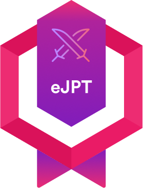

[English 🇬🇧](#english) | [Français 🇫🇷](#français)

## English

  <h1>Hi there, I'm Hossaïne  </h1>
  

    &nbsp;&nbsp;
  

  

## 👋 Here's a quick overview of who I am and what drives me :

- 🥖 I'm a French student passionate about cybersecurity, software development, and pretty much everything in IT
- 🧠 I learn best by doing — building tools, automating tasks, and diving into CTFs to sharpen my skills
- 🛠️ I'm driven by real-world challenges — the kind that push you to think deeply and give you that <em>"Yes! I cracked it!"</em> feeling
 - 🌱 I'm always aiming to grow, connect with others, and share useful things I create
 - 💡 I recently earned the <b>eJPTv2</b> certification and I'm continuing to focus on pentesting
 - 🎯 Long-term goal ? To become a <b>red team specialist</b> and work on offensive security full-time

## 👨🏽‍💻 Current Work / Projects in Progress :

A full cybersecurity homelab (red team and blue team) featuring a DMZ, a LAN and a virtual WAN using tools such as : WMware, pfSense, Docker Compose, Wazuh, Suricata.

## 🏅 Certifications

  

    
  

<h2 style="display: inline-block">💻 Tech Stack</h2>

### 👨‍💻 Languages

    
    
    
    
    
    
    

### 🧰 Frameworks and Libraries

    
    

### 🗄️ Databases

    
    
    

### 💻 Software and Tools

    
    
    
    
    
    
    
     
    
    
    
    
    
    
    
     
    
    
    
    
    

  <i>🌟 Thanks for visiting ! Feel free to star this repo if you liked it</i>

## Français

  <h1>Bonjour, je suis Hossaïne  </h1>
  

    &nbsp;&nbsp;
  

  

## 👋 Voici un aperçu rapide de qui je suis et de ce qui me motive :

- 🥖 Je suis un étudiant français passionné par la cybersécurité, le développement logiciel et, plus largement, tout ce qui touche à l'IT
- 🧠 J'apprends surtout en pratiquant — en créant des outils, en automatisant des tâches et en me plongeant dans des CTFs pour perfectionner mes compétences
- 🛠️ Ce qui me motive ? Des défis concrets et réalistes, le genre de défis qui font vraiment réfléchir et procurent ce sentiment <em>« Oui ! J'ai réussi ! »</em>
- 🌱 Je cherche toujours à progresser, à me connecter avec d'autres personnes et à partager les projets utiles que je crée
- 💡 J'ai récemment obtenu la certification <b>eJPTv2</b> et je continue à me concentrer sur le pentest
- 🎯 Objectif à long terme ? Devenir <b>spécialiste red team</b> et travailler à plein temps en cybersécurité offensive

## 👨🏽‍💻 Travail actuel / Projets en cours :

Un lab de cybersécurité complet (red team et blue team) contenant une DMZ, un LAN et un WAN virtuel en utilisant des outils tels que : WMware, pfSense, Docker Compose, Wazuh, Suricata.

## 🏅 Certifications

  

    
  

<h2 style="display: inline-block">💻 Stack technique</h2>

### 👨‍💻 Langages

    
    
    
    
    
    
    

### 🧰 Frameworks et bibliothèques

    
    

### 🗄️ Bases de données

    
    
    

### 💻 Logiciels et outils

    
    
    
    
    
    
    
     
    
    
    
    
    
    
    
     
    
    
    
    
    

  <i>🌟 Merci de votre visite ! N'hésitez pas à mettre une étoile si vous avez aimé</i>

