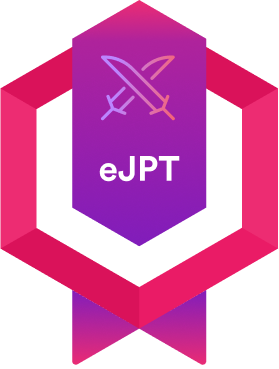
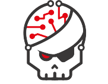

[English](#english) | [Français](#français)

  <h1>Hello friend! 
  </h1>

## English

### About

Cybersecurity student in my final year of a Bachelor's degree in Computer Science, focusing on operational security - both offensive (penetration testing) and defensive (SOC, detection engineering). I build hands-on labs and tools to practice what I learn, and I am looking for a 12-week+ internship in operational security starting March 2027.

- Obtained the **eJPTv2** certification in July 2025
- Currently preparing the **HTB CPTS** certification through the HTB Penetration Tester job-role path, targeting 2027
- Long-term goal: becoming a **red team specialist**, while staying comfortable on the defensive side

### Flagship project - Lab4PurpleSec

[**Lab4PurpleSec**](https://github.com/0xMR007/Lab4PurpleSec) - a complete, open-source Purple Team homelab (332+ stars, 41 forks) combining a vulnerable Active Directory environment (GOAD), a Docker-based web DMZ, pfSense + Suricata, and a Wazuh SIEM. It is provisioned with Vagrant and Ansible and documents realistic attack/detection scenarios (Kerberoasting, AS-REP Roasting, web exploitation) end to end.

### Certifications

  
  
  

<h3 style="display: inline-block">Tech stack</h3>

**Languages**

    
    
    
    
    
    
    

**Frameworks and libraries**

    
    

**Databases**

    
    
    

**Software and tools**

    
    
    
    
    
    
    
     
    
    
    
    
    
    
    
     
    
    
    
    
    
    
    
    
    
    

### Links

[TryHackMe](https://tryhackme.com/p/0xMR007) · [Root-Me](https://www.root-me.org/0xMR007) · [HackTheBox](https://profile.hackthebox.com/profile/019d340b-25ae-702f-ae15-809531cffc69)

  <i>Thanks for visiting - feel free to star my repos you find them useful.</i>

---

## Français

### À propos

Étudiant en cybersécurité, en dernière année de BUT Informatique, orienté sécurité opérationnelle - offensive (tests d'intrusion) comme défensive (SOC, détection). Je construis des labs et des outils pour mettre en pratique ce que j'apprends, et je recherche un stage de 12 semaines minimum en sécurité opérationnelle à partir de mars 2027.

- Certification **eJPTv2** obtenue en juillet 2025
- Préparation en cours de la certification **HTB CPTS** via le HTB Penetration Tester job-role path, examen visé en 2027
- Objectif à long terme : devenir **spécialiste red team**, tout en restant à l'aise côté défensif

### Projet phare - Lab4PurpleSec

[**Lab4PurpleSec**](https://github.com/0xMR007/Lab4PurpleSec) - un lab de cybersécurité Purple Team complet et open-source (332+ étoiles, 41 forks) combinant un environnement Active Directory vulnérable (GOAD), une DMZ web sous Docker, pfSense + Suricata, et un SIEM Wazuh. Provisionné avec Vagrant et Ansible, il documente de bout en bout des scénarios réalistes d'attaque et de détection (Kerberoasting, AS-REP Roasting, exploitation web).

### Certifications

  
  
  

<h3 style="display: inline-block">Stack technique</h3>

**Langages**

    
    
    
    
    
    
    

**Frameworks et bibliothèques**

    
    

**Bases de données**

    
    
    

**Logiciels et outils**

    
    
    
    
    
    
    
     
    
    
    
    
    
    
    
     
    
    
    
    
    
    
    
    
    
    

### Liens

[TryHackMe](https://tryhackme.com/p/0xMR007) · [Root-Me](https://www.root-me.org/0xMR007) · [HackTheBox](https://profile.hackthebox.com/profile/019d340b-25ae-702f-ae15-809531cffc69)

  <i>Merci de votre visite - n'hésitez pas à mettre une étoile à mes projets si vous les trouvez utiles</i>

